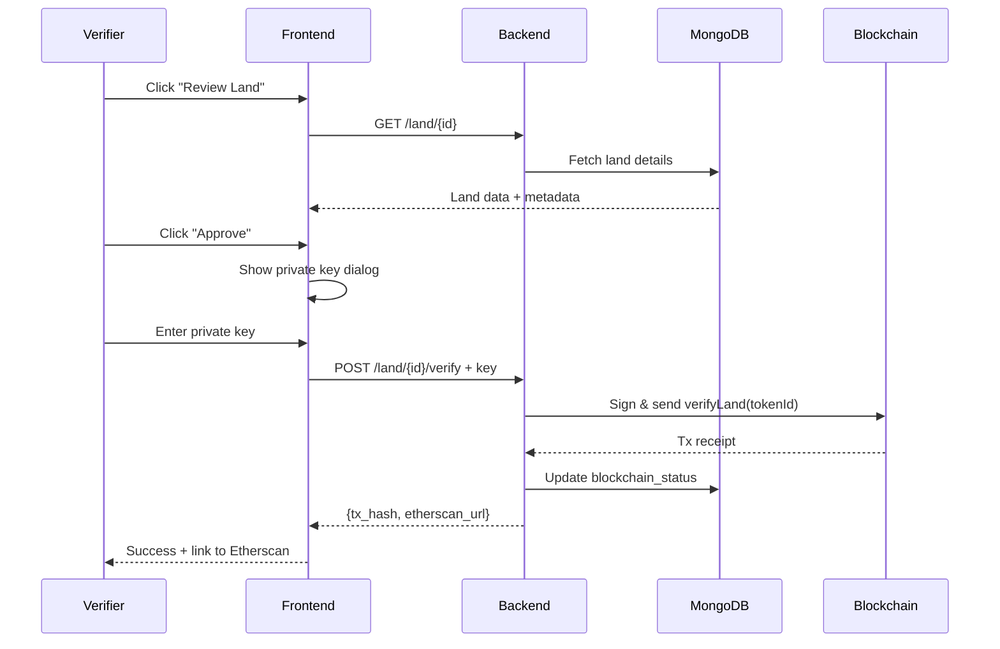

# Frontend Updated to Use Backend API ✅

## Changes Made

### 1. API Service Layer (`src/services/api.js`)
Added `verifierAPI` with four new methods:
- `getPendingLands()` - Fetch from `/land/pending/list`
- `getVerifiedLands()` - Fetch from `/land/verified/list`
- `verifyLand(landId, privateKey)` - POST to `/land/{id}/verify`
- `rejectLand(landId, reason, privateKey)` - POST to `/land/{id}/reject`

### 2. VerifierDashboard (`pages/VerifierDashboard.jsx`)
**Before:** Fetched from blockchain directly (slow, loops through all tokens)  
**After:** Fetches from backend API `/pending/list` (fast MongoDB query)

**Benefits:**
- ✅ Faster loading (MongoDB vs blockchain scanning)
- ✅ Gets MongoDB metadata (title, description, etc.)
- ✅ More reliable (no RPC issues)

### 3. ReviewLand (`pages/ReviewLand.jsx`)
**Before:** Called blockchain directly with MetaMask  
**After:** Calls backend API with private key input

**Major Changes:**
- Fetches land details from MongoDB (via `landAPI.getLandById`)
- Displays all land metadata (title, description, documents, etc.)
- Private key input dialogs for verify/reject
- Shows Etherscan links after successful transactions
- Displays verification status, timestamp, verifier address
- Shows rejection reason if rejected

---

## How It Works Now

### Verification Flow

```
1. Verifier clicks "Approve & Verify"
2. Dialog opens asking for private key
3. Enters private key (never stored)
4. Frontend calls: POST /api/v1/land/{id}/verify
5. Backend signs transaction with private key
6. Backend waits for blockchain confirmation
7. Backend updates MongoDB
8. Returns tx_hash + Etherscan link
9. Frontend shows success toast with link
10. Navigates back to dashboard
```

### Data Flow



---

## Security Notes

**Private Key Handling:**
- ⚠️ Private key entered in frontend dialog
- ⚠️ Sent to backend over HTTPS (required in production)
- ✅ Never stored anywhere
- ✅ Backend uses it only to sign transaction
- ✅ Cleared from memory immediately

**For Production:**  
Consider MetaMask signing (frontend signs, backend broadcasts) for better security.

---

## Benefits of Backend Integration

### Before (Direct Blockchain)
❌ Frontend scans entire blockchain  
❌ Slow loading times  
❌ MongoDB never updated  
❌ No notification system  
❌ No audit trail  
❌ RPC reliability issues  

### After (Backend API)
✅ Fast MongoDB queries  
✅ Database always in sync  
✅ Can add email notifications  
✅ Complete audit trail  
✅ Centralized error handling  
✅ Backend validates permissions  
✅ Transaction monitoring  

---

## Testing the Updated Frontend

### 1. Start Backend
```bash
cd backend
uvicorn app.main:app --reload
```

Make sure your `.env` has:
```
SEPOLIA_RPC_URL=https://sepolia.infura.io/v3/YOUR_KEY
ADMIN_PRIVATE_KEY=0xyour_key
```

### 2. Start Frontend
```bash
cd frontend
npm start
```

### 3. Test Flow
1. Login to frontend
2. Connect wallet (for role detection)
3. If you have VERIFIER_ROLE → "Verify Lands" appears
4. Click → Verifier Dashboard loads from backend
5. Click "Review" on a pending land
6. Enter your verifier private key
7. Click "Approve"
8. See blockchain transaction + Etherscan link
9. MongoDB updated automatically

---

## What's Different Now

| Component | Before | After |
|-----------|--------|-------|
| **VerifierDashboard** | Blockchain scan (slow) | Backend API (fast) |
| **ReviewLand** | MetaMask signing | Private key input |
| **Data Source** | Blockchain only | MongoDB + Blockchain |
| **Transaction** | Frontend → Blockchain | Frontend → Backend → Blockchain |
| **Database Sync** | Never updated | Auto-updated |
| **Metadata** | Basic (from blockchain) | Rich (from MongoDB) |
| **Error Handling** | Blockchain errors only | Backend validation + blockchain |

---

## Next Steps (Optional)

### Immediate
- Test with real backend running
- Add proper error boundaries
- Add loading skeletons

### Near Future
- Add event listener for auto-sync
- Implement email notifications
- Add transaction history page
- Build admin panel for managing verifiers

### Long Term
- Use MetaMask for signing (more secure)
- Add WebSocket for real-time updates
- Implement caching layer
- Add pagination for large lists

---

## Files Changed

1. ✅ `frontend/src/services/api.js` - Added verifierAPI
2. ✅ `frontend/src/pages/VerifierDashboard.jsx` - Uses backend API
3. ✅ `frontend/src/pages/ReviewLand.jsx` - Complete rewrite with backend integration

**Your frontend is now fully integrated with the backend blockchain API!** 🎉
